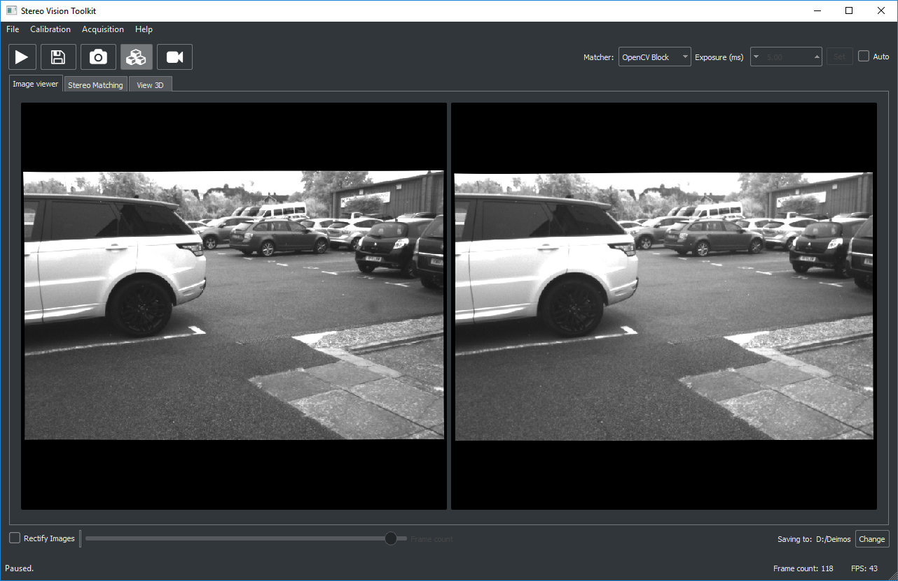
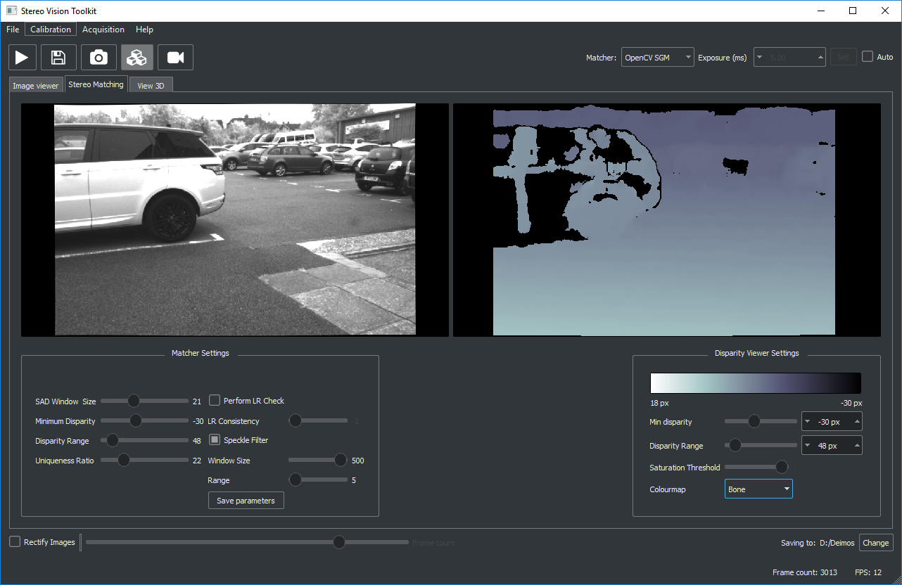

About
---

I3DR's stereo vision toolkit is a demonstration application provided for use with the Deimos stereo camera.

We expect that most people will write their own software to control the camera, but we've also provided this useful toolkit to get you going quickly. You can calibrate the camera, acquire images and perform matching and 3D reconstruction. You can save raw stereo video to capture a scene and then replay it in the software to fine tune matching parameters.

SVK is under active development. At the moment the software only officially supports the i3DR Deimos camera, but in principle any pre-rectified stereo video of the correct format (side-by-side) will work for evaluation.

Roadmap
---

Currently SVK is a useful and functional tool for exploring stereo imaging, and allows you to get going with your Deimos camera quickly. There are a number of features/improvements in development including:

- More options for video handling
- Support for other stereo matchers
- Assisted camera calibration and more detailed feedback
- Support for sequential capture (e.g. file naming options)
- Unit tests and other deployment issues
- Better 3D visualisation support

Stereo matching support
---
We have included support for two of OpenCV's matchers: the basic block matcher and semi-global block matching. The block matcher will run at over 60fps on a fast CPU (e.g. i5.) SGBM should provide better results, but will run around a factor of five slower.

Installation
---

The software is currently Windows-only, but we are likely to add support for Linux in the future. Currently the only component that is reliant on Windows is camera discovery, which uses DirectShow.

This repository contains everything you need to build the software using MSVC 2015 (including pre-built dependencies.) You will also need an up to date installation of Qt 5 and the NVIDIA Cuda SDK. Building with MinGW should be possible, but you will need to build the dependencies yourself. You may also need the Windows SDK.

Of course you can also link to your own pre-compiled versions of the dependencies, in this case you'll need to edit the `.pro` file with the appropriate `LIB` and `INCLUDEPATH`'s.

Installation should be as simple as importing the `.pro` file into Qt Creator and building. You will need to copy the required DLLs (in the 3rd party folders) to your output folder, unless you happen to have things in your PATH already. If the program immediately crashes in Qt Creator, suspect a missing DLL (try running directly from the build folder.)

Usage
---

The software has three tabs: image acquisition, stereo matching and 3D visualisation. This is a typical stereo pipeline: images are acquired, optionally rectified, matched and then projected to 3D. You can save images, disparity maps and point clouds (to PLY format). Disparity maps are saved as 16-bit integer images for convenience, so divide by 256 to get sub-pixel measurements.

3rd Party Content
---
The project uses OpenCV for image processing, PCL and VTK for point cloud visualisation and hidapi for camera control. PCL requires Boost and Eigen which are included here. These dependencies are provided in accordance with their respective licenses which may be found in the license folder. We also use FontAwesome for icons via QtAwesome, along with QDarkStyle.

There is limited usage of CUDA for certain image processing steps (e.g. rectification).

This repository is used for internal development and so we include both debug and release libraries and DLLs. This makes for quite a large repository for a rather small codebase (around 500MB), so be warned.

Development
---

This application is under active development and it is likely that in the short term there may be breaking changes to classes, or significant changes to the GUI. Documentation will follow shortly. Have a look at the project milestones for more information.

Feel free to send us pull requests!

Notes
---
This code is provided under the MIT license, which essentially means it's open source, but we require you to add our copyright if you distribute it elsewhere.
